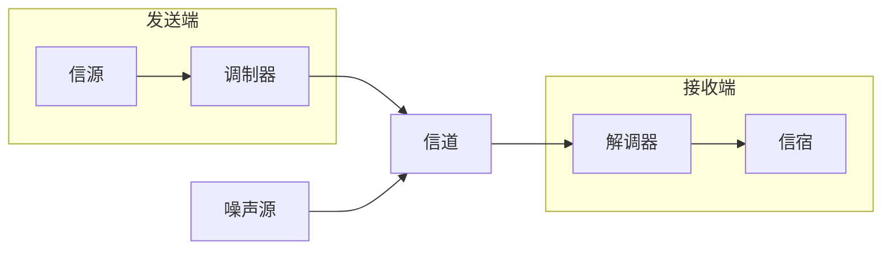
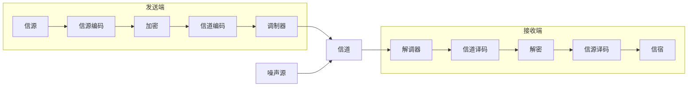

# 通信系统的组成

  

## 模拟通信系统
模拟通信系统框图如下：  

!!! success "信号在接入信道之前的是发送端，在输出信道之后为接收端"

---

## 数字通信系统  
数字通信系统框图如下：  

  
=== "信源编码与译码"  
    - 完成数/模转换  
    - 将数字信号进行压缩，提高信号传输的有效性  
    - 信源译码是信源编码的逆过程  

=== "信道编码与译码"  
    - 信道编码对输入的代码加入{==监督位==}并进行{==差错控制编码==}  
    - 信道译码发现或纠错接收码元中的错误，提高可靠性  

=== "加密与解密"   
    - 加密提高了所传信息的安全  
    - 解密恢复加密前的信息  

=== "数字调制与解调"  
    - 将信号从低频段搬移到高频段，提高信号的传输效率，达到{==频分复用==}的目的。
    - 数字调制形成适合在信道中传输的{==带通信号==}。
    - 数字解调是数字调制的逆过程。

=== "同步"  
    - 使得收发两端的信号在时间上保持步调一致。  

---

## 通信系统的分类

### 通信系统分类

=== "按信号特征分类"
    - 模拟通信
    - 数字通信
=== "按信号复用方式分类"
    - 频分复用FDM
    - 时分复用TDM
    - 码分复用CDM
    - 空分复用SDM：利用多路空间上的正交信道来同时传输信号达到扩容的目的
=== "按传输方式分类"
    - 基带传输
    - 频带传输

---

### 通信方式分类

| 按消息传递方向和时间 | 定义 | 典型例子 |
| :--- | :--- | :--- |
| **单工通信** | 消息只能单方向传递 | 广播、无线寻呼 |
| **半双工通信** | 通信双方都能收或发消息，但不能同时进行收发 | 使用同一载频的普通对讲机 |
| **全双工通信** | 通信双方可同时收发消息 | 电话通信 |

--- 

| 按数据排列方式 | 定义 | 优缺点 |
| :--- | :--- | :--- |
| **并行传输** | 将代表消息的数字码元序列以组成的方式存在两条或两条以上的并行信道上同时传输 | 优点：节省传输时间，速度快，不需要字符同步措施； 缺点：需要多条通信线路，成本高，不适合远距离通信。 |
| **串行传输** | 将代表消息的数字码元序列以串行方式一个码元一个码元在一条信道上传输 | 优点：只需一条通信信道，节省线路铺设费用，适合远距离传输； 缺点：速度慢，需要外加码组或字符同步措施。 |

---
## 数字通信系统优缺点
=== "优点（多处理干扰，综合经济域）"
    - 多：便于{==多路复用==}
    - 处理：便于{==便于数字信号处理==}
    - 干扰：抗干扰能力强
    - 综合：有利于实现综合业务网（语音、视频上网）
    - 经济：便宜
    - 域：易于集成化
=== "缺点（同款设备）"
    - 同：同步要求高
    - 款：宽频带
    - 设备：设备更加复杂

=== "现代通信系统的主要特点"
    - 智能化、远距离、大容量、多信源、数字化、高效率、保密性、可靠性
    - 终极目标：任何人在任何时间和空间的可随时通信

---

## 通信系统的两种重要变化
- 消息 --> 原始电信号（基带信号）  

- 调制信号（基带信号）--> 已调信号（频带信号）  

---
## 已调信号的两个基本特征
- 携带消息
- 适合在信道中传输

---

## 模拟通信系统研究的主要问题
- 调制解调原理
- 噪声背景下的信号传输

---