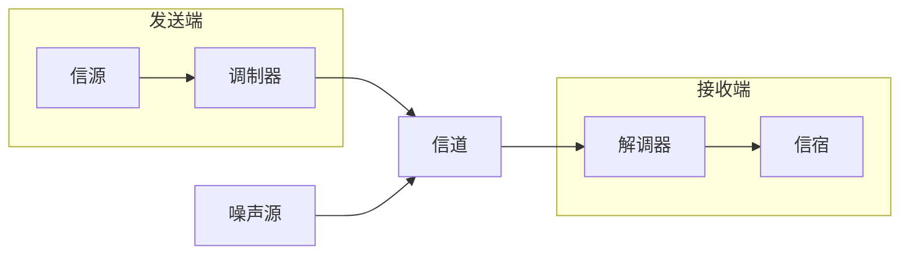
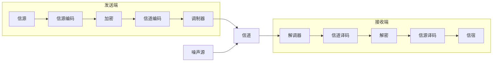

# 通信系统的组成

  

## 模拟通信系统
模拟通信系统框图如下：  

!!! success "信号在接入信道之前的是发送端，在输出信道之后为接收端"

---

## 数字通信系统  
数字通信系统框图如下：  

  
=== "信源编码与译码"  
    - 完成数/模转换  
    - 将数字信号进行压缩，提高信号传输的有效性  
    - 信源译码是信源编码的逆过程  

=== "信道编码与译码"  
    - 信道编码对输入的代码加入监督位并进行差错控制编码  
    - 信道译码发现或纠错接收码元中的错误，提高可靠性  

=== "加密与解密"   
    - 加密提高了所传信息的安全  
    - 解密恢复加密前的信息  

=== "数字调制与解调"  
    - 数字调制形成适合在信道中传输的{==带通信号==}。数字解调是数字调制的逆过程。

=== "同步"  
    - 使得收发两端的信号在时间上保持步调一致。
